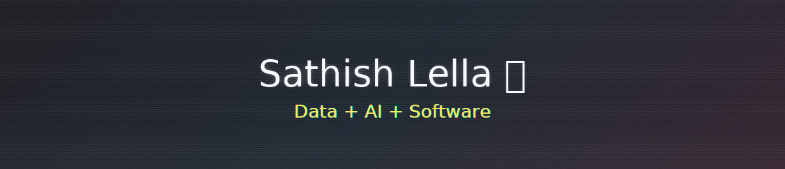

# ✨ Sathish Lella — Data-Driven Innovator

<!--
  Creative developer showcase:
  - glitch banner (SVG) with PNG fallback
  - typing headline
  - gradient capsules + animated separators
  - trophy, stats, streaks
  - bouncy project thumbnails (GIF pulse)
  Tip: keep all local images under /assets to ensure GitHub mobile reliability.
-->

<p align="center">
  <!-- Glitch banner (SVG) -->
  <picture>
    <source type="image/svg+xml" srcset="https://svg-banners.vercel.app/api?type=glitch&text1=Sathish%20Lella%20%F0%9F%9A%80&text2=Data%20%2B%20AI%20%2B%20Software&width=1200&height=260" />
    <!-- PNG fallback in your repo -->
    
  </picture>
</p>

<p align="center">
  <!-- Typing headline -->
  
</p>

<!-- neon separators -->
<p align="center">
  
</p>

<pre>
┌─[sathish@data-lab]─[~/projects/insights]
└──╼ $ whoami
Data Analyst • Software Developer • Researcher | MS Data Science candidate
</pre>

### TL;DR

- 3+ years blending **analytics + engineering** to deliver measurable outcomes  
- Highlights: **-15% load time / +20% engagement** (UI), **-78% access time** (API keys), **-83% resolution time** (support), **-75% incidents** (AI security)  
- Mission: **Craft responsible AI + analytics that improve security, efficiency, and growth**

<p align="center">
  <a href="https://www.linkedin.com/in/sathishlella">
    
  </a>
  <a href="mailto:lellasathish490@gmail.com">
    
  </a>
  <a href="https://scholar.google.com/citations?user=4xwc2BgAAAAJ&hl">
    
  </a>
</p>

<p align="center">
  <!-- soft wave -->
  
</p>

## 📌 Signature Snapshot (Terminal-style)

<pre>
┌─[sathish@data-lab]─[~/achievements]
└──╼ $ ls -la
drwxr-xr-x  3+ years   experience delivering data-driven solutions
-rw-r--r--  +20%       engagement via UI optimisation (Mphasis)
-rw-r--r--  -15%       page load time (Mphasis)
-rw-r--r--  -78%       data access time via API key streamlining
-rw-r--r--  -83%       support resolution time (Tech Mahindra)
-rw-r--r--  -75%       home invasions w/ AI security (HappyMonk Chokidr)
</pre>

## 🧭 Vision

> Building **responsible AI & analytics** that convert raw data into **safer systems**, **faster decisions**, and **real business value**.

<p align="center">
  <!-- gradient neon bar -->
  
</p>

## 🧰 Triple-Stack (Data • Software • Research)

<p align="center">
  
</p>

<details>
<summary><b>Show me the code-style persona</b> (TypeScript)</summary>

```typescript
class TripleSpecialist {
  private domains = {
    data: ["Python","SQL","ML","Tableau","Power BI"],
    software: ["JavaScript","Node.js","React","MongoDB"],
    research: ["CV","NLP","Segmentation","Predictive Modeling"],
    leadership: ["Collaboration","Teaching","PM"]
  };
  mission = "Solve complex problems with data-driven software and AI";
  createImpact() { return "Blend data × software × research → ship value"; }
}
