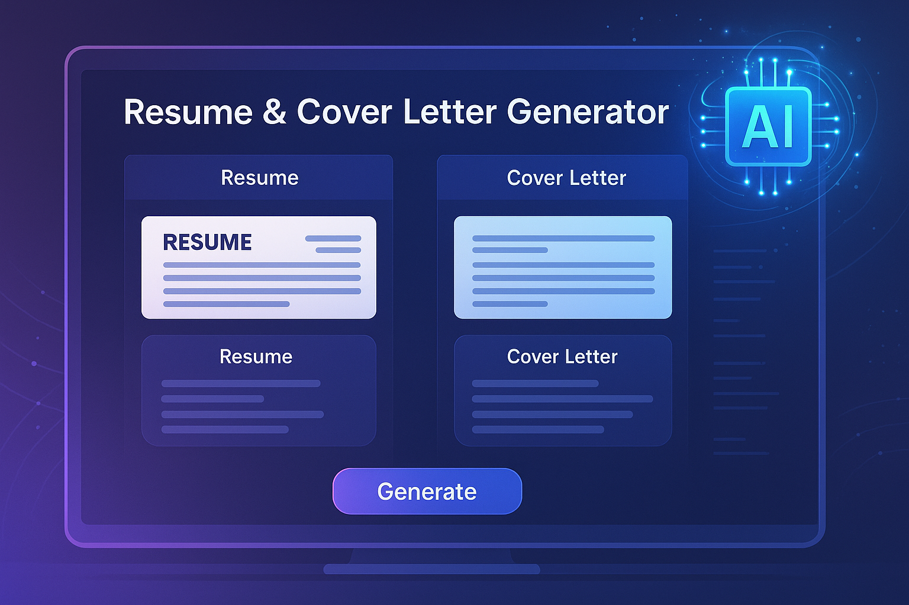
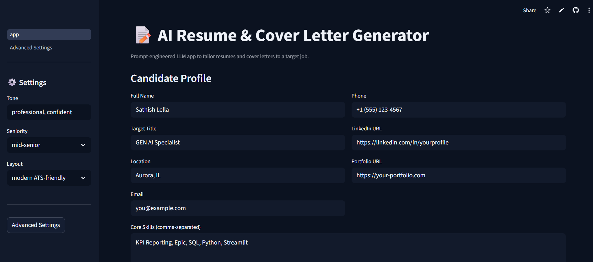
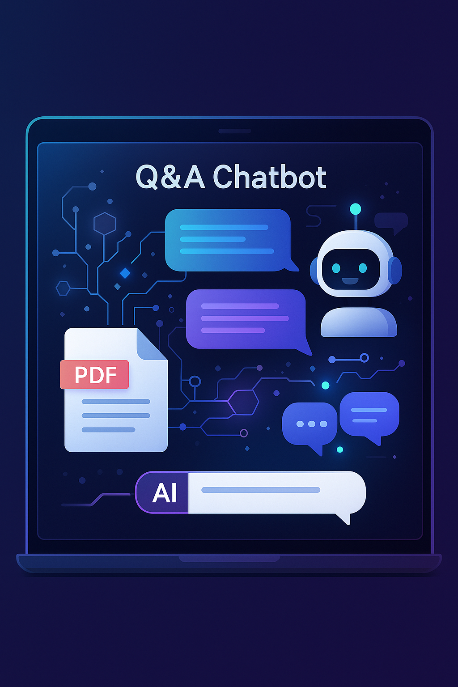
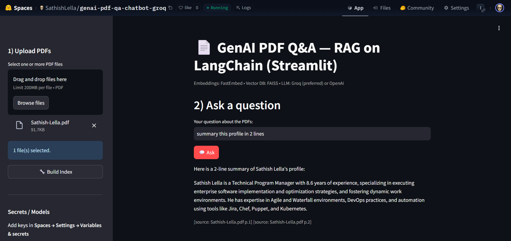
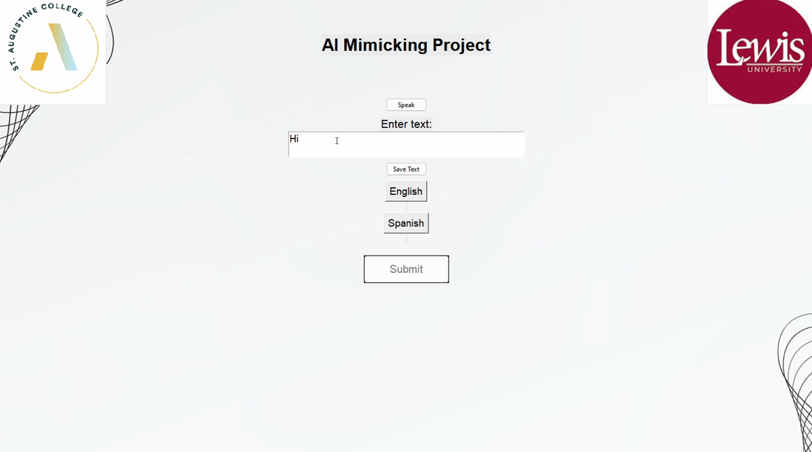
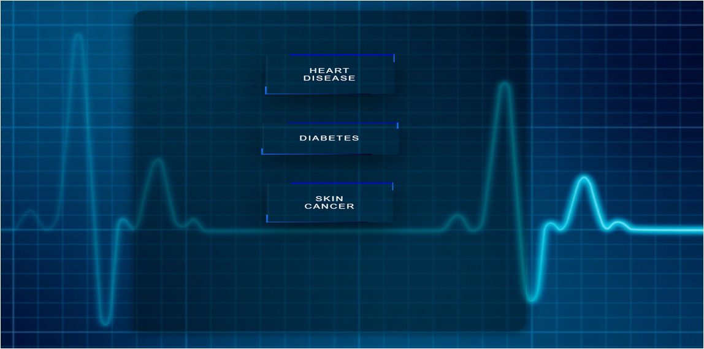
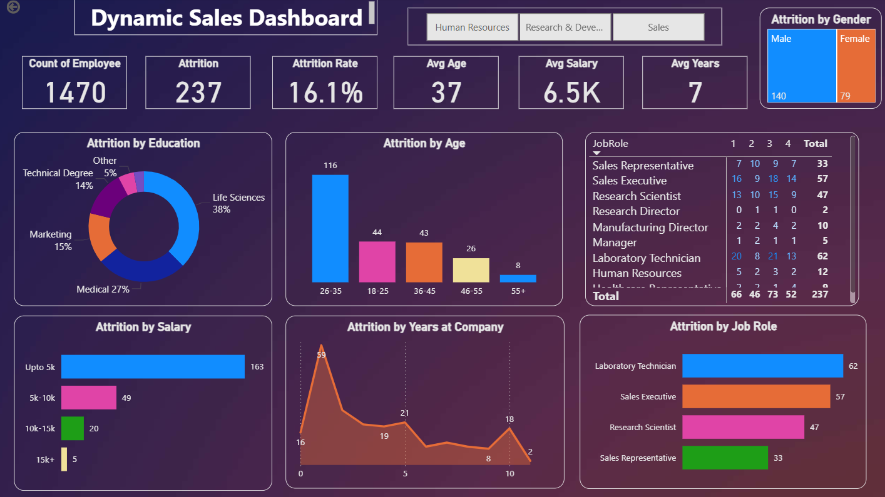

# ✨ Sathish Lella — Data‑Driven Innovator

<!-- Creative developer showcase README with glitch banner + typing effect.
     All assets stored locally in /assets for reliable mobile rendering. -->

<!-- Core + Frontend -->

  

<!-- Data / AI (use scikitlearn; drop seaborn/matplotlib here) -->

  

<!-- Databases / Tools -->

  

<!-- DevOps / Cloud -->

  

<!-- BI & plotting (not in skillicons → use badges so there are no gaps) -->

  
  
  
  

<pre>
┌─[sathish@data-lab]─[~/projects/insights]
└──╼ $ whoami
Data Analyst • Software Developer • Researcher | MS Data Science candidate
</pre>

### TL;DR
- Hands-on projects that blend **analytics + engineering** to deliver outcomes  
- Focus areas: UI performance, API efficiency, RAG chatbots, dashboards, and health AI  
- Mission: **Responsible AI & analytics** → safer systems, faster decisions, real value

  
  
  

  

## 🧰 Triple Stack (Data • Software • Research)
<!-- Core languages & frontend -->

  

<!-- Data/AI stack -->

  

<!-- Databases, APIs, tooling -->

  

<!-- DevOps / Cloud -->

  

<!-- BI tools not on skillicons → use badges -->

  
  

---

## 🚀 Projects — Creative + Motion

### 📝 AI Resume & Cover Letter Generator (NLP)

  
   

  
   

**Stack:** Python • Streamlit • LLMs  
**Value:** Tailors resumes & cover letters quickly with consistent professional tone.

---

### 📄 GenAI PDF Q&A — RAG on LangChain

  
   

**Stack:** LangChain • FAISS • Embeddings  
**Value:** Ask questions about your PDFs and get context-aware answers.

---

### 📊 AI Review Sentiment Dashboard

  
   

**Stack:** Python • Streamlit • NLP  
**Value:** Visual insights into review sentiment for product decisions.

---

### 🧠 AI Mimicking Project

  
   

**Focus:** translation, sentiment, math, econ, interactive conversations.

---

### 🩺 Dr.ML — Health Analytics

  
   

**Models:** diabetes • heart disease • skin cancer (DL + Flask).

---

### 📈 Dynamic Sales Dashboard (Power BI)

  
   

**Outcome:** decision-ready KPIs across roles, time, and segments.

  

## 🏆 Activity & Stats

  
  

  

  

## 🌟 Let’s Build the Future
> “The future belongs to those who believe in the beauty of their code.”

  <a href="mailto:lellasathish490@gmail.com">lellasathish490@gmail.com</a> •
  <a href="https://www.linkedin.com/in/sathishlella">LinkedIn</a> •
  <a href="https://scholar.google.com/citations?user=4xwc2BgAAAAJ&hl">Scholar</a>

