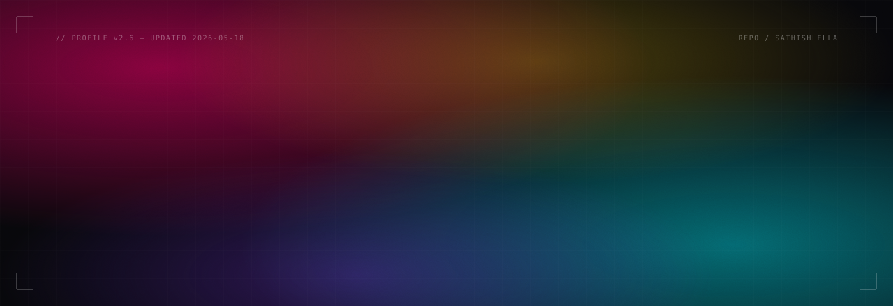

<!-- ==================== HERO ==================== -->

  <b>AI Engineer building production multi-agent systems, RAG pipelines, and secure SaaS platforms.</b> 
  Founding Engineer @ F1 Dream Jobs · Building one new agent every day, in public, for 100 days

  
  
  

 

<!-- ==================== THE MANIFESTO ==================== -->
<table align="center" width="100%">
  <tr>
    <td align="center" width="100%">
      <h2><i>"I ship production AI agents — 15+ shipped, several with real users — and publish in CRC Press &amp; Springer. Right now I'm building one new agent every day, in public, for 100 days."</i></h2>
    </td>
  </tr>
</table>

 

 

<!-- ==================== AGENTS ==================== -->
<h2 align="center">⚡ Production Systems — shipped, verifiable, in use</h2>

<i>Every project below is real, deployed where noted, and independently checkable.</i>

<table align="center">
  <tr>
    <td width="33%" valign="top" align="center">
      <b>Legal Practice Platform</b> 
      Multi-tenant law-firm SaaS — subscription revenue, active users RBAC/RLS, ethical walls, MFA, permission-aware AI document analysis
        
      
    </td>
    <td width="33%" valign="top" align="center">
      
        
      <b>Contract risk analysis agent</b> 
      80+ red flags · 60+ clause types 3-second risk scoring · zero LLM core
        
      
      
    </td>
    <td width="33%" valign="top" align="center">
      
        
      <b>4-agent GitHub due-diligence swarm</b> 
      Repo-level investment/audit analysis in seconds
        
      
      
    </td>
  </tr>
  <tr><td colspan="3" height="20"></td></tr>
  <tr>
    <td width="33%" valign="top" align="center">
      
        
      <b>Autonomous production code healer</b> 
      120+ patterns · 8 languages 200+ rule knowledge base · zero LLM core
        
      
    </td>
    <td width="33%" valign="top" align="center">
      
        
      <b>Multi-agent business simulation</b> 
      9+ agents · debate · consensus Groq Llama 3.3 · Vercel Serverless
        
      
      
    </td>
    <td width="33%" valign="top" align="center">
      
        
      <b>AI resume &amp; cover-letter builder</b> 
      ATS-optimized scoring and rewriting
        
      
      
    </td>
  </tr>
  <tr><td colspan="3" height="20"></td></tr>
  <tr>
    <td width="33%" valign="top" align="center">
      
        
      <b>Personalized 30-day learning roadmap</b> 
      4-agent swarm · 80+ resource platforms
        
      
    </td>
    <td width="33%" valign="top" align="center">
      <b>F1 Dream Jobs</b> 
      Premium IT staffing &amp; career-transformation platform Full-stack CRM built from scratch, GPT-4 candidate matching
        
      
    </td>
    <td width="33%" valign="top" align="center">
      
        
      <b>Client-facing production site</b> 
      Design &amp; build for a Kuala Lumpur café brand
        
      
      
    </td>
  </tr>
</table>

 

 

<!-- ==================== STACK ==================== -->
<h2 align="center">⚙ What ships these</h2>

  

  
  
  
  
  
  
  

 

<!-- ==================== EXPERIENCE ==================== -->
<h2 align="center">🏢 Currently &amp; Recently</h2>

<table align="center" width="100%">
  <tr>
    <td width="50%" valign="top">
      <h3>🟢 Founding Engineer · F1 Dream Jobs</h3>
      Feb 2026 — Present · Remote
      
Sole technical owner of an AI-powered recruiting platform. Built full-stack CRM from scratch (TypeScript + React + Node.js + PostgreSQL + GPT-4) processing <b>200+ CVs/day</b>. Designed RAG pipeline with vector DB for semantic candidate matching. AI agents for outreach, interview prep, and screening reduced manual recruiter effort by <b>70%+</b>.

    </td>
    <td width="50%" valign="top">
      <h3>⚫ Built &amp; Operated · Velden Health</h3>
      Jun 2025 — Apr 2026 · Wound down
      
Built the technical infrastructure for a healthcare revenue recovery firm focused on outpatient behavioral health practices. Custom OS tracking <b>1,000+ insurance claims</b>, A/R aging dashboards, predictive recovery scoring, denial workflow automation.

    </td>
  </tr>
</table>

 

<!-- ==================== EDUCATION + RESEARCH ==================== -->
<h2 align="center">🎓 Education &amp; Research</h2>

<table align="center" width="100%">
  <tr>
    <td width="50%" valign="top">
      <h3>Education</h3>
      <ul>
        <li><b>DBA</b> · Taylor's University · 2026 — 2029 · <i>Part-time, weekends only</i></li>
        <li><b>MS Data Science</b> · Lewis University · 2023 — 2024 · GPA 3.5</li>
        <li><b>B.Tech ECE</b> · Aditya University · 2017 — 2021</li>
      </ul>
    </td>
    <td width="50%" valign="top">
      <h3>Published</h3>
      <ul>
        <li><i>Real-Time Monitoring &amp; Predictive Maintenance</i> — <b>Wiley</b>, book chapter</li>
        <li><i>ML-based Signal Strength Localization</i> — <b>Springer</b></li>
        <li><i>Standardizing Denial Management in Behavioral Health</i> — <b>Zenodo</b>, 2026</li>
      </ul>
    </td>
  </tr>
</table>

 

 

<!-- ==================== CTA ==================== -->
<h2 align="center">📡 Let's talk</h2>

  <i>Available for select AI engineering engagements — multi-agent systems, RAG pipelines, production AI infrastructure. I respond within 24 hours.</i>

  
  

 

<i>Built in public · Updated 2026-09-26 · <a href="https://github.com/sathishlella/sathishlella">profile source</a></i>

