

<a href="https://www.sathishlella.online">
  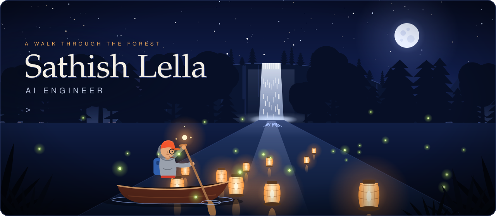
</a>

**I build LLM applications, RAG systems and AI agents that hold up in real work.**

Based in Selangor, Malaysia &nbsp;|&nbsp; This page is a short walk through the forest. The long one, with a guide, a canoe and a waterfall, is at <a href="https://www.sathishlella.online">sathishlella.online</a>.

 

  

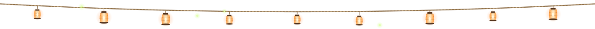

<!-- 01 SUMMARY -->
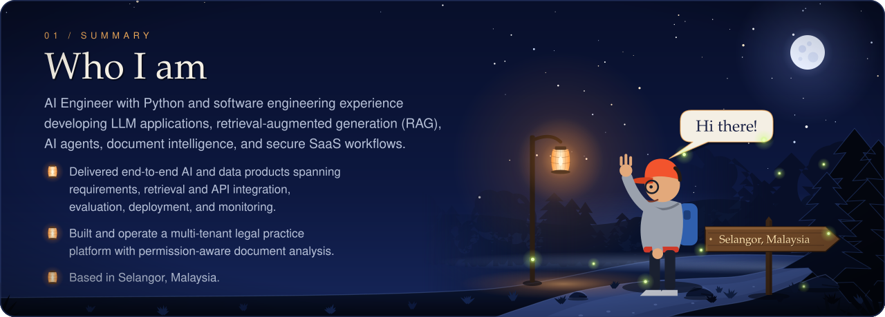

<!-- 02 EXPERIENCE -->
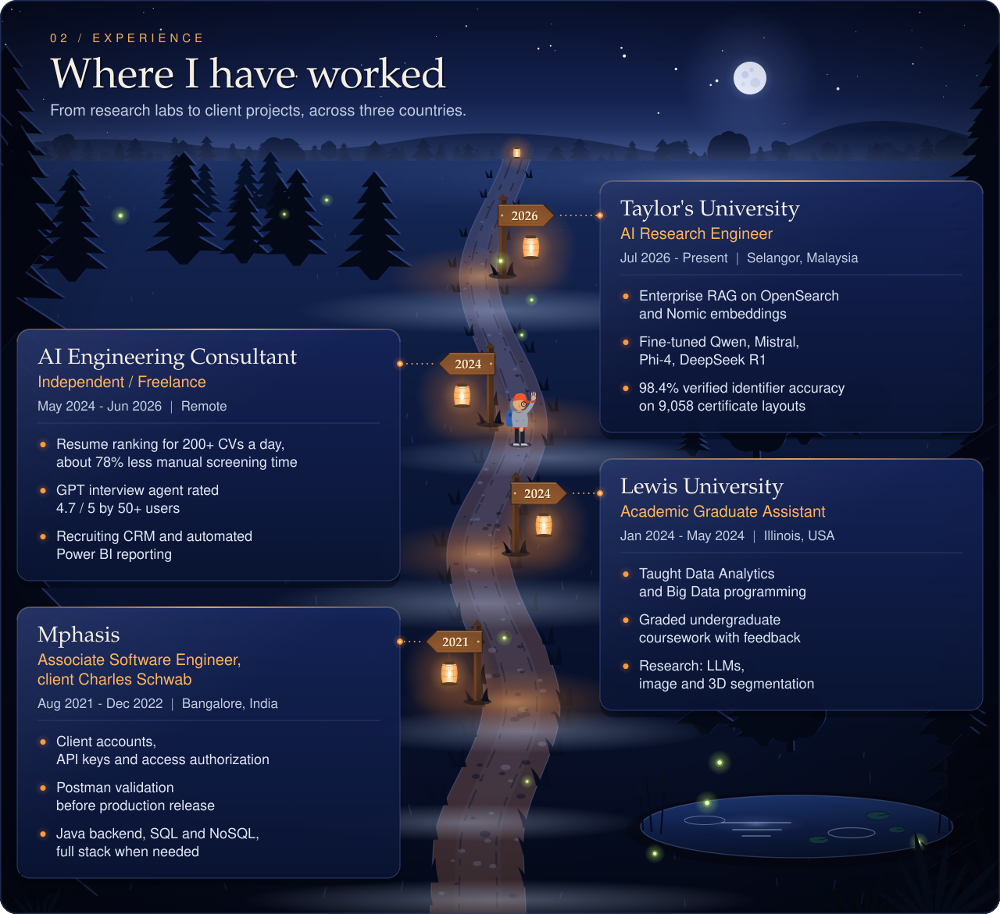

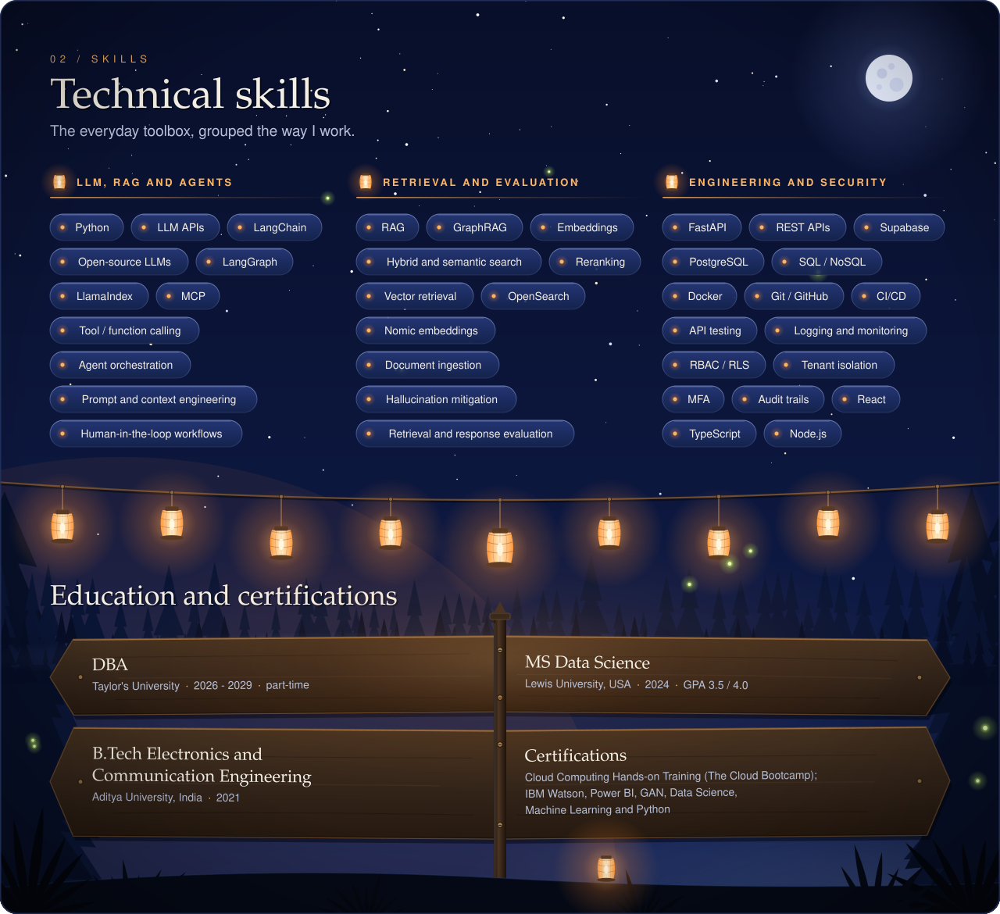

<!-- 03 PROJECTS -->
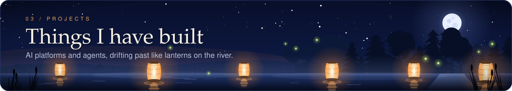

<table>
  <tr>
    <td width="50%"><a href="https://legal-practice-platform-seven.vercel.app/">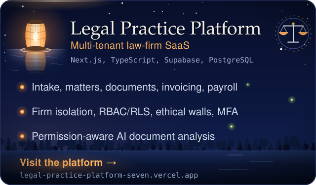</a></td>
    <td width="50%"><a href="https://github.com/sathishlella/Autonomous-Platform-Intelligence-Agent">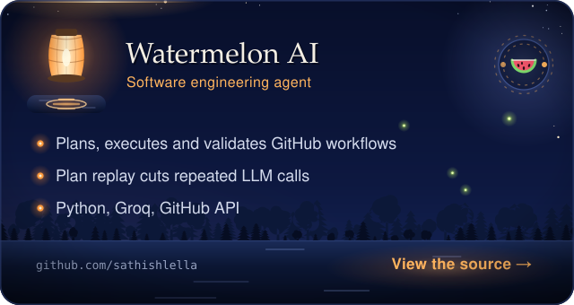</a></td>
  </tr>
  <tr>
    <td width="50%"><a href="https://www.sathishlella.online">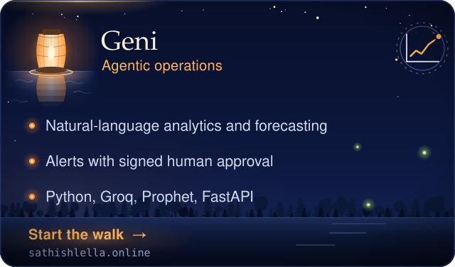</a></td>
    <td width="50%"><a href="https://contract-scan-gilt.vercel.app">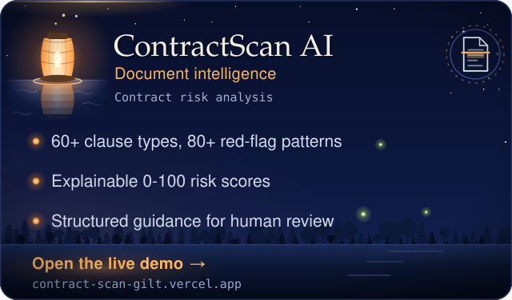</a></td>
  </tr>
  <tr>
    <td width="50%"><a href="https://www.sathishlella.online">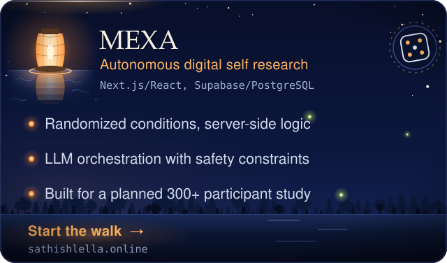</a></td>
    <td width="50%"><a href="https://github.com/sathishlella/selfheal">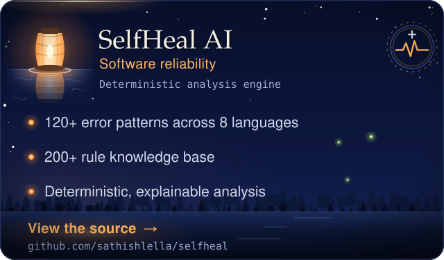</a></td>
  </tr>
  <tr>
    <td width="50%"><a href="https://www.sathishlella.online">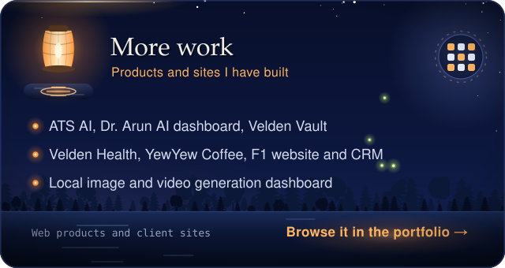</a></td>
    <td width="50%"><a href="https://www.sathishlella.online">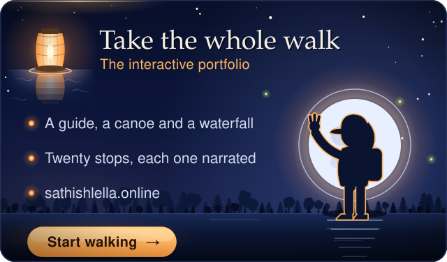</a></td>
  </tr>
</table>

  Also on GitHub:
  <a href="https://github.com/sathishlella/gitpulse-ai">GitPulse AI</a> &middot;
  <a href="https://github.com/sathishlella/ScenarioMind">ScenarioMind</a> &middot;
  <a href="https://github.com/sathishlella/SkillMap-AI">SkillMap AI</a> &middot;
  <a href="https://github.com/sathishlella/ats-ai-resume-builder">ATS AI</a> &middot;
  <a href="https://github.com/sathishlella/yewyew-coffee-website">YewYew Coffee</a> &middot;
  <a href="https://github.com/sathishlella/100-days-100-ai-agents">100 Days, 100 AI Agents</a>

<!-- 04 PUBLICATIONS -->
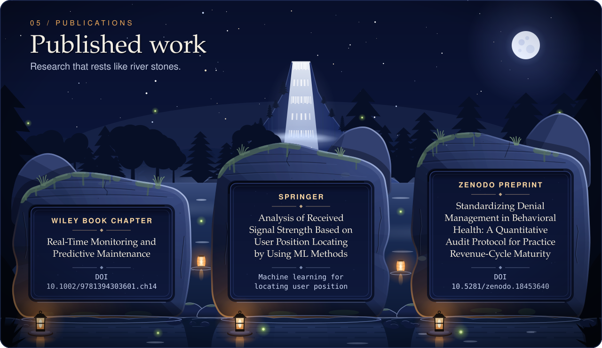

  <a href="https://doi.org/10.1002/9781394303601.ch14">Wiley chapter</a> &nbsp;&middot;&nbsp;
  <a href="https://link.springer.com/chapter/10.1007/978-981-15-7511-2_22">Springer paper</a> &nbsp;&middot;&nbsp;
  <a href="https://doi.org/10.5281/zenodo.18453640">Zenodo protocol</a> &nbsp;&middot;&nbsp;
  <a href="https://scholar.google.com/citations?user=4xwc2BgAAAAJ&hl=en">Google Scholar</a>

<!-- ACTIVITY -->
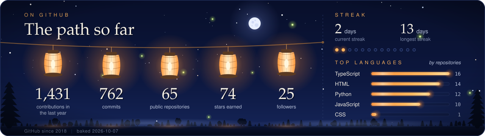

<!-- 05 CONTACT -->
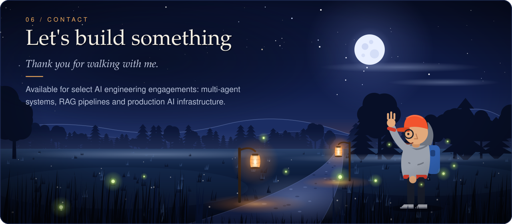

   

Read it as plain text

**Sathish Lella, AI Engineer** (Selangor, Malaysia). I build LLM applications, RAG systems and AI agents that hold up in real work.

**Experience**
- **Taylor's University**, AI Research Engineer, Jul 2026 - Present. Enterprise RAG on OpenSearch and Nomic embeddings; fine-tuned Qwen, Mistral, Phi-4 and DeepSeek R1; 98.4% verified accuracy on 9,058 certificate layouts.
- **AI Engineering Consultant**, independent, May 2024 - Jun 2026. Resume ranking for 200+ CVs a day, about 78% less manual screening; a GPT interview agent rated 4.7 / 5 by 50+ users; a recruiting CRM and automated Power BI reporting.
- **Lewis University**, Academic Graduate Assistant, Jan 2024 - May 2024. Taught Data Analytics and Big Data programming, graded coursework, contributed to research on LLMs and image and 3D segmentation.
- **Mphasis**, Associate Software Engineer on the Charles Schwab account, Aug 2021 - Dec 2022. Client accounts, API keys and access authorization; Postman validation before production release; Java backend, SQL and NoSQL.

**Projects**: Legal Practice Platform (multi-tenant law-firm SaaS), Watermelon AI (software engineering agent), Geni (agentic operations), ContractScan AI (contract risk analysis), MEXA (autonomous digital self research), SelfHeal AI (deterministic error analysis), and more at [sathishlella.online](https://www.sathishlella.online).

**Publications**: a Wiley book chapter on real-time monitoring and predictive maintenance; a Springer paper on locating users with machine learning; a Zenodo audit protocol for denial management in behavioral health.

**Education**: DBA, Taylor's University (2026 - 2029, part-time); MS Data Science, Lewis University (2024, GPA 3.5 / 4.0); B.Tech Electronics and Communication Engineering, Aditya University (2021).

